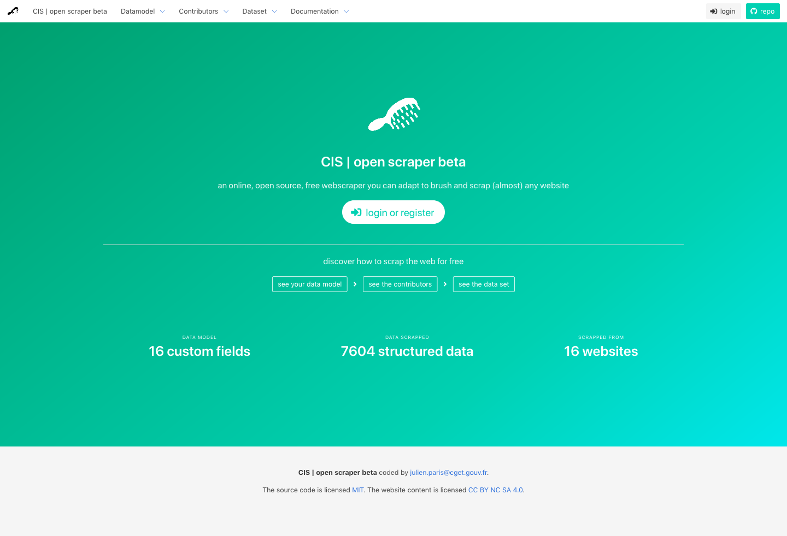
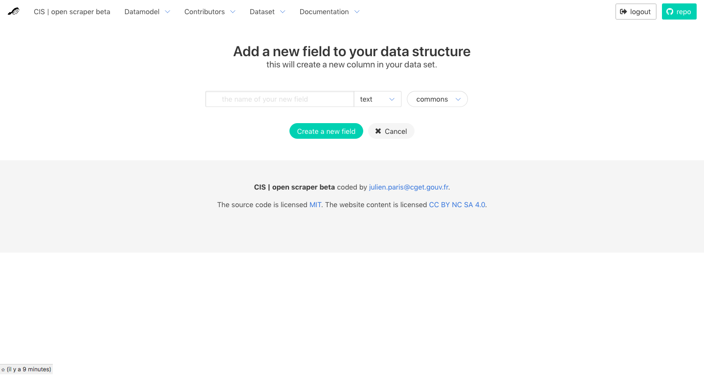
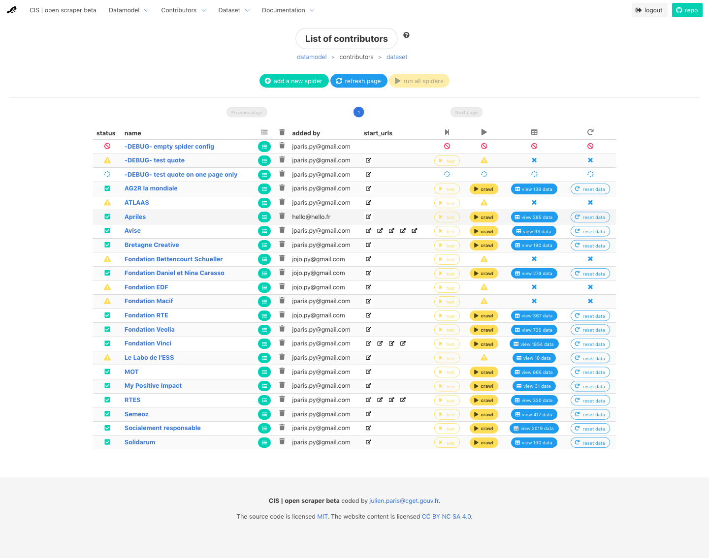
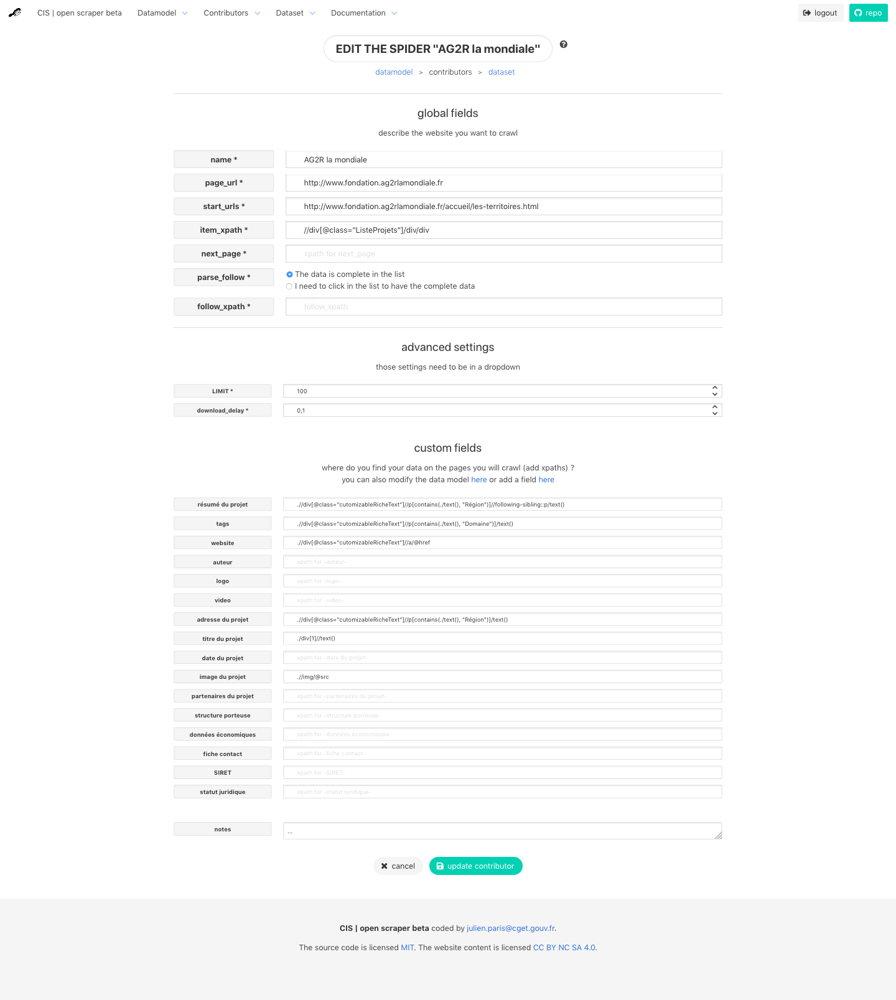
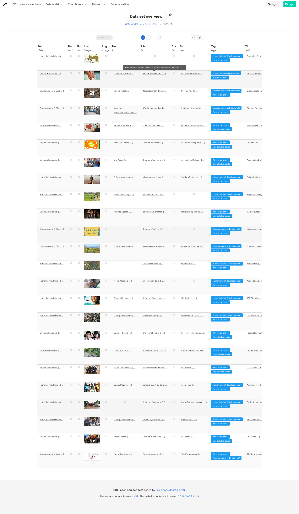

<h1 align=center>  OpenScraper</h1>

<h4 align=center> a public service for webscraping</h4>

<h2 align=center>
	
</h2>

OpenScraper is a minimalistic, open source webscraper with a simple interface, <b>so almost anyone with very little technical knowledge could scrap public data</b> and install/adapt it for its own purposes... for free.

... anyway, that's the goal folks ! ...  (it's a development phase for now)

<h4 align=center> OpenScraper is a project by <a href=https://entrepreneur-interet-general.etalab.gouv.fr/defi/2017/09/26/socialconnect/ >SocialConnect</a></h4>

#python #tornado #scrapy #mongodb #bulma

----
## ARGUMENT

#### **To which needs this project aims to answer ?**
Scraping can quickly become a mess, mostly if you need to scrap several websites in order to eventually get a structured dataset. Usually you need to set up several scrapers for every website, configure the spiders one by one, get the data from every website, and clean up the mess to get from this raw material one structured dataset you know that exists... 

#### **Yes, similar solutions already does exist... but...**
So you have mainly three options when it comes to scrap the web : 
- either use a proprietary and quite expensive service (like [Apify](https://www.apify.com/) or [import.io](https://www.apify.com/)) and depend on an external service ;
- ask a friend if you are lucky, ask a developer or a company to do it for you if you have money for that...
- or if you have the know-how write your own code (for instance based on BeautifulSoup or Scrapy), adapt it for your own purposes, and usually be the only one (I mean the only developer around) to be able to use/adapt it.

#### **A theoretical use case**
So let's say you are a **researcher**, a **journalist**, a **public servant** in an administration, a member of any **association** who want to survey some evolutions in the society... Let's say you need data not easy to get, and you can't afford to spend thousand of euros in using a private service for webscraping. 

You'd have a list of different websites you want to scrap similar information from, each website having some urls where are listed those data (in our first case social innovation projects). For every information you know it could be similarly described with : a title, an abstract, an image, a list of tags, an url, and the name and url of the source website, and so on... 

So to use OpenScraper you would have to : 
- specify the data structure you expect ("_title_", "_abstract_", etc...) ;
- add a new _contributor_ (a source website) : at least its _name_ and the _start_url_ from which you'll do the scraping ; 
- configure the spider for every _contributor_, i.e. specify the xpaths for every field (xpath for "title", xpath for "abstract", etc... );
- save the _contributor_ spider configuration, and click on the "run spider" button... 
- the data will be stored in the OpenScraper database (MongoDB), so you could later retrieve the structured data (with an API endpoint or in a tabular format like a .csv file)

#### **An open scraper for more digital commons**
To make that job a bit easier (and far cheaper) OpenScraper aims to display an online GUI interface (a webapp on the client side) so you'll just have to set the field names (the data structure you expect), then enter a list of websites to scrap, for each one set up the xpath to scrap for each field, and finally click on a button to run the scraper configured for each website... 

... and tadaaaa, you'll have your data : you will be able able to import it, share it, and visualize it (at least we're working on it as quickly as we can)... 

OpenScraper is developped in open source, and will provide a documentation as much as a legal framework (licence and CGU) aiming to make the core system of OpenScraper fit the [RGPD](https://en.wikipedia.org/wiki/General_Data_Protection_Regulation), in the letter and in the spirit. 

-------

## INSTALLATION WALKTHROUGH

1. **clone or [download](https://github.com/entrepreneur-interet-general/OpenScraper/archive/master.zip) the repo**
1. **[install MongoDB](https://docs.mongodb.com/manual/installation/) locally** or get the URI of the MongoDB you're using
1. **go to your openscraper folder**
1. **install the libraries (without [virtual environment](https://pypi.python.org/pypi/virtualenv))**

	> $ pip install -r requirements.txt

1. **update the `config/settings.py` file** with your mongoDB URI (if you're not using default mongoDB connection)

1. **run app** from `$ ~/../app_scrapnado`

	> $ python main.py

1. **check in your browser** at `localhost:8000`

1. **create/update your datamodel** at `localhost:8000/datamodel/edit`

1. **create/update your spiders** at `localhost:8000/contributors`

1. **run the test spider in the browser** by clicking on the test spider at  `localhost:8000/contributors`

------

## TECHNICAL POINTS

#### Tech stack
- _Language_ : **Python**... because let's be honest, I don't manage so many languages for that kind of project
- _Backend_  : **[Tornado](http://www.tornadoweb.org/en/stable/)**... one of the few async/non-blocking Python frameworks
- _Scraping_ : **[Scrapy](https://scrapy.org/)**, perhaps with **[Selenium](http://selenium-python.readthedocs.io/) for Python**  inside specific instances of the generic spider, or **Splash** for jquery follow-up...
- _Frontend_ : **[Bulma](https://bulma.io/)**  (to make it nice) and then **[Vue.js](https://vuejs.org/)** (to make it even nicer and bi-directional)

#### Tech goals for a MVP
- web interface to edit the data structure
- Python asynchronous interface (Tornado) for Scrapy 
- store a list of url sources + corresponding xpaths in a DB (Mongo)
- web interface to edit the sources' xpath list
- display the list of sources + for each add a button to run the scraper
- store/extract results in the DB

------

## ROADMAP TO A MVP

#### To do list :
1. DONE - understand basics of Tornado (reuse some tutorial material)
1. DONE - basic Tornado + MongoDB setup
1. DONE - understand basics of Scrapy
1. DONE - UI to create user (register), create/update a datamodel, create/update a spider configuration
1. DONE - add a GUI to configure the data structure you expect from the scraping
1. DONE - create a generic spider (class) + generic item to fill, both callable from handlers
1. DONE - integrate generic spider + tests + run
1. DONE - make Tornado and a basic scrapy spider work together (non-blocking)
1. DONE - make a nice front in Bulma 
1. add API points for JSON feeds
1. ... nicer front in vue.js

#### Currently : 
- currently at steps /10
- working on several generic spiders : pure html websites working quite well
- working on the API points
- ...

#### Notes for later / issues :
- must add logic to masterspider to request APIs
- must migrate/copy data to a Elastic search (not only MongoDB) 
- must add a feature to use Selenium inside a spider if needed (ajax or .click function)
- ...

-------
## CREDITS 

#### OpenScraper's team thanks :

- the [SocialConnect](https://entrepreneur-interet-general.etalab.gouv.fr/defi/2017/09/26/socialconnect/) project, aka "Carrefour des Innovations Sociales"
- the [EIG](https://entrepreneur-interet-general.etalab.gouv.fr/) program by [Etalab](https://www.etalab.gouv.fr/)
- [CGET](http://www.cget.gouv.fr/)

#### Contacts :

- [Julien Paris](<mailto:julien.paris@cget.gouv.fr>) (aka [JPy](https://twitter.com/jparis_py) on Twitter)

---------

## SCREENSHOTS (development)

-------

-------

-------

-------

-------

